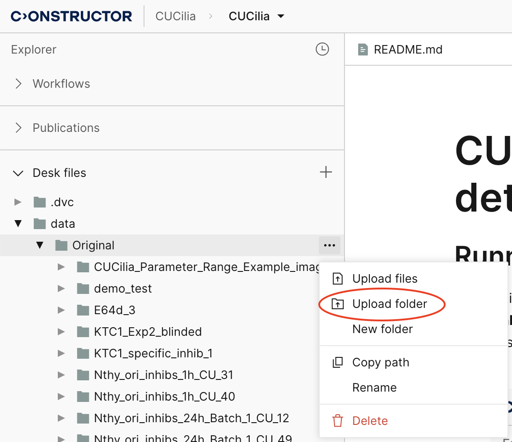
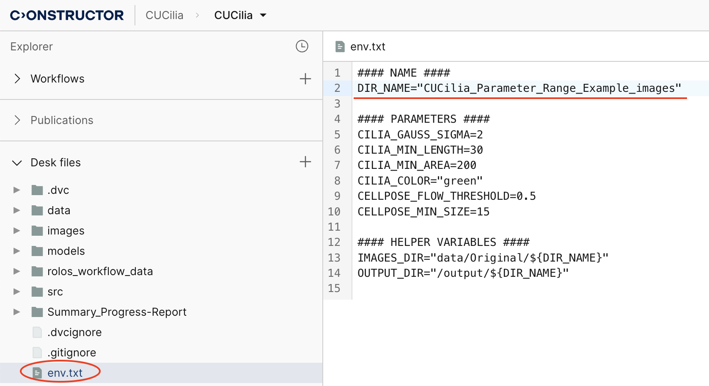
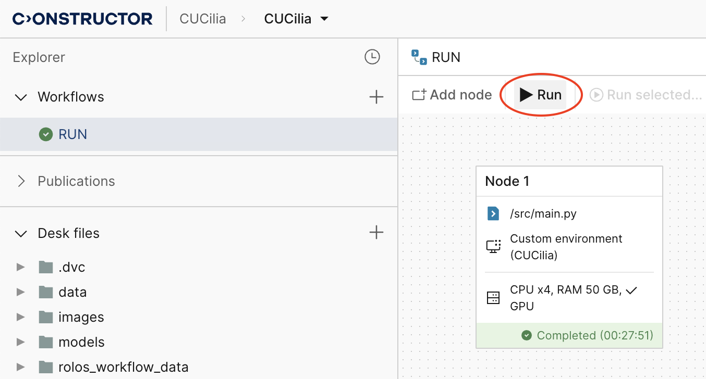
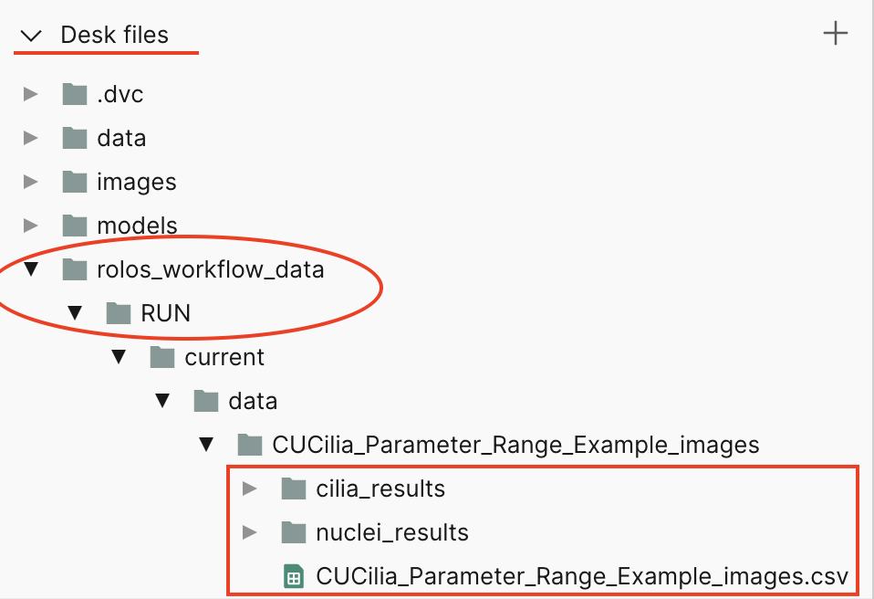
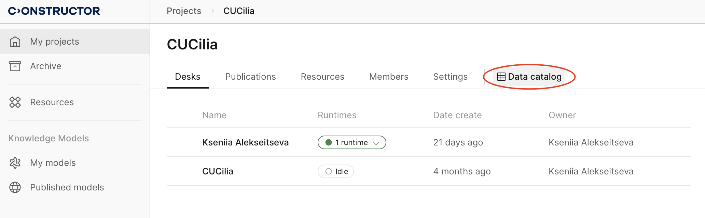
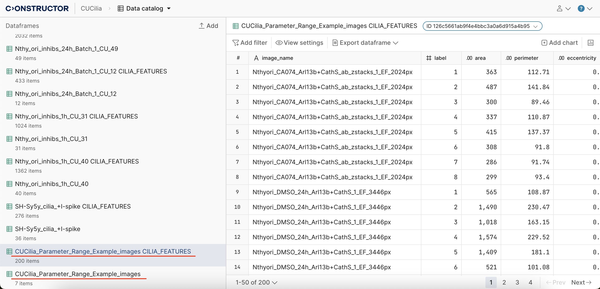

# CU Cilia: Nuclei and cilia detection


## Running on Constructor Platform (CP)

1. Inside the `data` folder, create a new folder and upload your images there. **Only `tiff` and `tif` image formats are supported**. You can also upload images within a nested folder structure if necessary.

    

2. In `env.txt`, change the `DIR_NAME` to the name of the folder you created (`CUCilia_Parameter_Range_Example_images` in this case):

    

    And change other parameters if needed:
    - `CILIA_GAUSS_SIGMA` (float, optional): Standard deviation for the Gaussian kernel. The standard deviations of the Gaussian filter can be specified for each axis as a sequence, or as a single number, in which case it is the same for all axes. Defaults to 8.
    - `CILIA_TOPHAT_RADIUS` (int, optional): The radius of the disk-shaped footprint for white top hat transformation. Defaults to 13.
    - `CILIA_MIN_LENGTH` (float, optional): All cilia with a length below this value, in pixels, will be discarded. Defaults to 14.
    - `CILIA_MIN_AREA` (float, optional): All cilia with an area below this value, in pixels, will be discarded. Defaults to 256.
    - `CILIA_MIN_ECCENTRICITY` (float, optional): All cilia with eccentricity below this value, in pixels, will be discarded. Defaults to 0.46.
    - `CILIA_MIN_PERIMETER` (float, optional): All cilia with a perimeter below this value, in pixels, will be discarded. Defaults to 67.
    - `CILIA_COLOR` (str, optional): The color (channel) of cilia in the provided images. Options: “red”, “green”, “red+green”. Defaults to “red+green”, which means the algorithm uses the sum of the channels as the input image.
    - `CILIA_FEATURES` (list, optional): List of features to calculate and visualize. Defaults to '["area", "perimeter", "eccentricity", "form_factor", "axis_minor_length", "axis_major_length", "skeleton_length"]' (pay attention to the syntax!).
    - `EXCLUDE_EDGE_CILIA` (bool, optional):  This flag determines whether to exclude cilia located at the edges of the analyzed area. When set to True, the system will ignore edge cilia in calculations or data processing. By default, this option is set to False.
    - `CELLPOSE_FLOW_THRESHOLD` (float, optional): Flow error threshold (all cells with errors below this threshold are kept). Defaults to 0.4.
    - `CELLPOSE_MIN_SIZE` (int, optional): All ROIs (Regions of Interest) below this size, in pixels, will be discarded. Defaults to 15.
    - `EXCLUDE_EDGE_NUCLEI` (bool, optional): This flag indicates whether nuclei positioned at the boundaries of the analysis region should be excluded. When enabled (True), these edge nuclei will not be considered in the analysis. The default value is False.
    - `RUN_LOCALLY` (bool, optional): This flag specifies whether the operation should be executed on a local machine rather than the Constructor Platform. Setting this to True will run the process locally. Defaults to False.

3. Go to the `Workflows` section and choose the `RUN` workflow, then press the `▶️ Run` button to start processing.

    

4. After the workflow is finished, you can find the results (images with detected cilia and nuclei, as well as csv-files with aggregated results) in the `rolos_workflow_data/RUN/current/data` folder in Desk files.

    

    The final results will be available in the `Data Catalog` in the main project window - two tables:
    - characteristics of each eyelash - table with `CILIA_FEATURES` suffix
    - aggregated measurements for each image

    


    


## Running on your own machine

This section provides instructions for running the CU Cilia system on your local machine.

### Dependencies

The project has been thoroughly tested with the following configurations:

- Ubuntu 20.04
- CUDA 11.7
- Python 3.8
- PyTorch 1.13.0


### Installing
```
git clone git@github.com:andrewbo29/cu_cilia.git
cd cu_cilia
pip install -r requirements.txt
```

### Executing program

1. Add new data into a separate folder in `data/Original` (if you want to process an existing folder, you need to execute `dvc pull data/Original` first).

2. Download weights for nuclei segmentation model: `dvc pull models/cellpose_thyroid`

2. Change the value of `DIR_NAME` in `env.txt` to the name of the new folder within `data/Original`. If you want to process data in a different location, update the `IMAGES_DIR` accordingly. Also, set the `OUTPUT_DIR` to specify the destination folder for the results.

    **Important: If you're running the code locally and not on the Constructor Platform, add `RUN_LOCALLY=True` to `env.txt` (or `export RUN_LOCALLY=True` in your terminal). This ensures the system doesn't attempt to write to the data catalog on the Constructor Platform, thereby avoiding errors.**


3. Run the whole pipeline:
    ```
    python src/main.py
    ```
    
    Or you can run each stage (nuclei segmentation, cilia detection, joining the results) separately:
    ```
    python src/run_nuclei_segmentation.py
    python src/run_cilia_detection.py
    python src/join_nuclei_and_cilia_results.py
    ```
